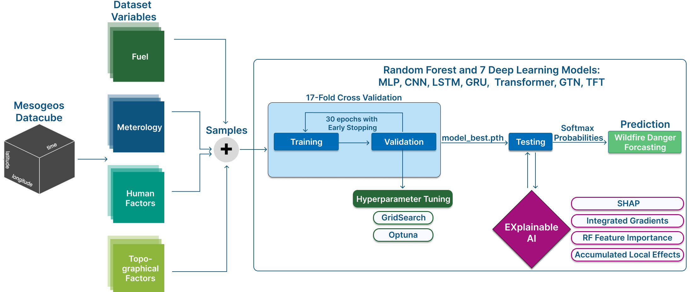

# Designing and Explaining Temporal Deep Learning Models for Wildfire Danger Prediction

This project focuses on **wildfire danger forecasting** using advanced **temporal deep learning models** combined with **explainable AI (XAI)** techniques, based on the [**Mesogeos** dataset](https://orionlab.space.noa.gr/mesogeos/) — a publicly available spatio-temporal datacube covering the Mediterranean region from 2006 to 2022 at a resolution of **1 km × 1 km × 1 day**.

In this work, we evaluate multiple deep learning architectures (including LSTM, GRU, CNN, MLP, Transformer, Gated Transformer Network and Temporal Fusion Transformer) against a Random Forest baseline and apply state-of-the-art XAI methods to enhance interpretability.  

### Key XAI Analyses:
- **SHAP (SHapley Additive exPlanations):** Feature attribution and ranking across models, temporal dynamics of variable importance, and physical consistency checks with known wildfire drivers.
- **Integrated Gradients (IG):** Sample-level attributions for specific fire events and feature effect comparisons between models.
- **Accumulated Local Effects (ALE):** Non-linear feature sensitivity analysis to understand global variable impacts on predictions.
- **Case studies and interpretability metrics:** Detailed analysis of model predictions for significant fire events and comparison of explanation patterns.

These analyses not only provide accurate fire danger predictions but also offer insights into **how and why the models make their decisions**, bridging the gap between data-driven methods and domain knowledge in wildfire science.

Interested about the project? Explore the full details, methodology, and results here: 
- 📄 [Bachelor Thesis PDF](Documentation/Bachelorthesis_Pauline_Becker.pdf)
- 🎥 [Thesis Presentation Slides](Documentation/BA_Presentation_Pauline_Becker_final.pdf)

---

## Data Repository

The dataset originates from **Mesogeos**.  
You can download it from the following Google Drive folder:

 **[Mesogeos Data Repository](https://drive.google.com/drive/folders/1aRXQXVvw6hz0eYgtJDoixjPQO-_bRKz9)**

This folder includes:
- **`mesogeos_cube.zarr/`**: The full Mesogeos datacube  
- **`ml_tracks/`**: Contains the pre‑extracted datasets from Mesogeos that serve as the foundation of this project. We build upon these datasets by implementing additional models and extending the pipeline with explainable AI (XAI) analyses.
- **`notebooks/`**: Jupyter notebook demonstrating how to access and process the Mesogeos datacube

- ### Datacube Citation

Spyros Kondylatos, Ioannis Prapas, Gustau Camps-Valls, & Ioannis Papoutsis. (2023).  
**Mesogeos: A multi-purpose dataset for data-driven wildfire modeling in the Mediterranean.**  
*Zenodo*. [https://doi.org/10.5281/zenodo.7473331](https://doi.org/10.5281/zenodo.7473331)

---
## Machine Learning Pipeline Architecture

This project implements a temporal deep learning pipeline for wildfire danger prediction Mesogeos Datacube. Samples are extracted from the datacube, combining features from four domains: Fuel, Meteorology, Human Factors, and Topography. A 17-fold cross-validation is applied, and models are trained with early stopping and hyperparameter tuning using GridSearch and Optuna, saving the best checkpoint (`model_best.pth`). Predictions are produced as class probabilities via a Softmax layer. To interpret the models, we apply SHAP, Integrated Gradients, and Accumulated Local Effects (ALE), linking feature attributions to physically meaningful wildfire drivers.

### Pipeline Overview
 

---

## Repository Structure

```
mesogeos/
├── ml_tracks/
│   └── a_fire_danger/
│       ├── a_danger_forecasting/     # Contains classification data files (e.g., negatives.csv and positives.csv)
│       ├── configs/                  # Model-specific configs (MLP, CNN, LSTM, etc.)
│       ├── dataloaders/              # Data loading utilities
│       ├── datasets/                 # Dataset definitions
│       ├── integrated_gradients/     # IG computation & plotting
│       ├── models/                   # Model architectures & metrics
│       ├── saved/                    # Stores all model outputs and artifacts
│       │   └── ale/                  # Stores first-order and second-order ALE plots for feature effect analysis
│       │   └── ig/                   # Stores computed Integrated Gradients (CSV/NPZ) and their corresponding plots
│       │   ├── model/                # Stores trained model checkpoints (e.g., model_best.pth)
│       │   ├── log/                  # Contains log files and the used config files for each training/testing run
│       │   ├── shap_plot/            # Stores computed SHAP values (CSV/NPZ) and their corresponding plots
│       ├── shap_local/               # SHAP computation & plotting
│       ├── trainer/                  # Training scripts & utilities
│       ├── tester/                   # Evaluation and testing scripts
│       └── utils/                    # Helper utilities
│       └── train.py                  # Entry point for training
│       └── test.py                   # Entry point for testing
|
├── notebooks/                        # Jupyter notebooks for exploring the Mesogeos datacube and analyzing raw variables
├── outputs/                          # Analysis outputs and notebooks for evaluating ML and XAI results and generating plots
├── requirements.txt                  # Python dependencies
└── README.md                         # Project documentation
```
---

## Training a Model

Install all the requirements from the requirements.txt file. 

```bash
pip install -r requirements.txt
```

To train a model (e.g., MLP), check if the dataset path to the "dataset_root" in the config files correspond to your correct path.

run:
```bash
python train.py --config configs/config_<model_name>/config_train.py
```

This will train the model and save the best checkpoint under saved/models as 'model_best.pth' and under saved/log a info.log file with all information about the trainings process. 

---

## Testing / Evaluation

1. Open the corresponding `config_test.py` file and update the `model_path` entry to point to the `model_best.pth` checkpoint.
2. Run:
   ```bash
   python test.py --config configs/config_<model_name>/config_test.py
   ```
---

## Explainable AI (XAI)

We use **SHAP (SHapley Additive Explanations)** and **Integrated Gradients (IG)** to interpret the predictions of trained models.

#### Compute SHAP:
```bash
python shap_local/compute_shap.py --config configs/config_<model_name>/config_train.py
```
#### Compute IG:
```bash
python integrated_gradients/compute_ig.py --config configs/config_<model_name>/config_train.py
```

In the configuration files, the `checkpoint_path` specifies the location of the trained model checkpoint (e.g., `model_best.pth`), and the `shap_path` defines where the computed SHAP and Integrated Gradients (IG) values and plots will be stored. These paths may need to be adjusted depending on your local directory structure or when using different models or experiments.

---

## Visualization and Interpretation with Jupyter Notebooks

The `outputs/` folder contains Jupyter notebooks specifically designed to **analyze, interpret, and visualize the results of trained machine learning (ML) models** and their explainable AI (XAI) outputs. These notebooks collectively provide a comprehensive framework to interpret ML models applied to wildfire forecasting, evaluate their performance, and connect their predictions to physically meaningful insights.

### Included Notebooks
- **`big_fires.ipynb`**: Analysis of large fire events and their associated predictors.  
- **`compare_models.ipynb`**: Comparison of ML model performance (metrics, curves, and results).  
- **`confusion_matrix_analysis.ipynb`**: In-depth analysis of false positives and false negatives.  
- **`csv_timeseries_before_fire_plot.ipynb`**: Visualization of time-series data leading up to fire events.  
- **`evaluate_cv_results.ipynb`**: Cross-validation evaluation across different models and configurations.  
- **`F1_Score_Comparison.ipynb`**: Direct comparison of F1 scores across multiple trained models.  
- **`physical_interpretability.ipynb`**: Relating SHAP/IG attributions to environmental and physical drivers.  
- **`RF_FeatureImportance_Top24.ipynb`**: Feature importance analysis for Random Forest baselines.  
- **`shap_analysis.ipynb`**: SHAP value computation and visualization for feature impact assessment.  
- **`shap_clustering.ipynb`**: Clustering of SHAP patterns to identify groups of similar model explanations.  
- **`shap_ig_plots.ipynb`**: Combined visualization of SHAP and Integrated Gradients explanations.  
- **`softmax_outputs_plots.ipynb`**: Plotting softmax output distributions and model confidence levels.  
- **`Timelag_Analysis.ipynb`**: Investigation of time lags and their influence on model predictions.  


## 🙏 Contributors and Acknowledgements

This project was developed as part of my Bachelor's thesis on Designing and Explaining Temporal Deep Learning Models for Wildfire Danger Prediction.  

I would like to express my sincere gratitude to [Peer Nowack](mailto:peer.nowack@kit.edu) and [Carolina Moura](mailto:carolina.moura@kit.edu) for their invaluable guidance and continuous support throughout the course of this thesis. Their expertise, encouragement, and insightful feedback were instrumental in shaping the direction and quality of this work.  
I am also deeply thankful to [Lina Rennstein](mailto:lina.rennstein@kit.edu) (PhD at the Chair for AI in Climate and Environmental Sciences) for her patience and for answering my numerous questions about HoreKa, as well as for her suggestions regarding visualization approaches for my thesis.  
Finally, I would like to thank [Julian Strietzel](https://www.linkedin.com/in/julian-strietzel/) for his unwavering support, understanding, and encouragement.

